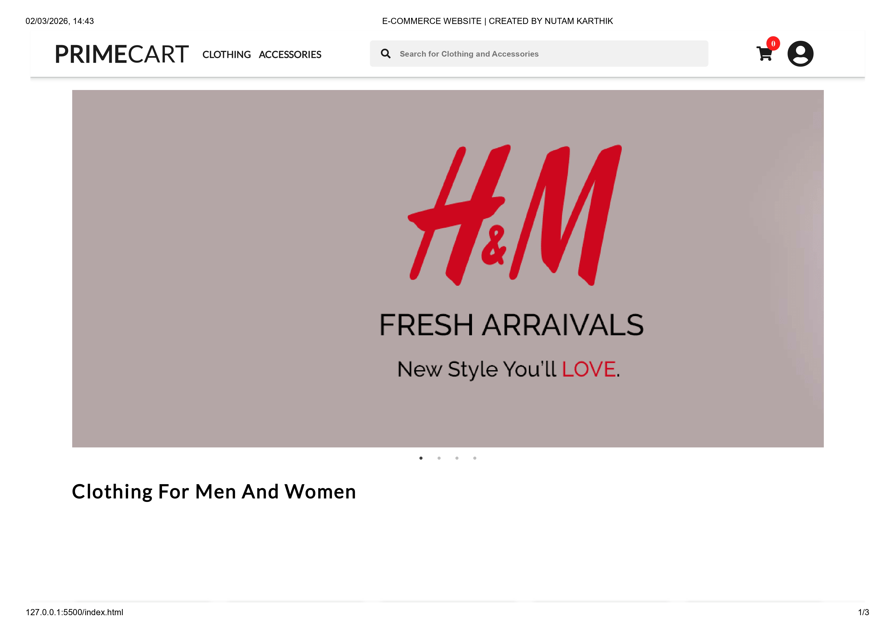
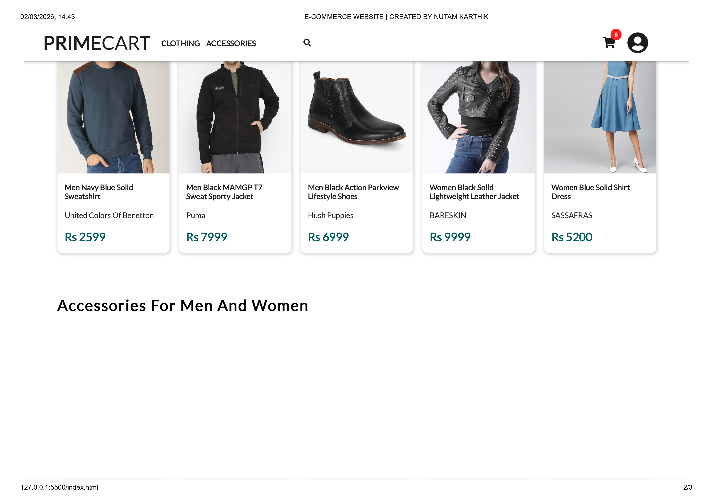
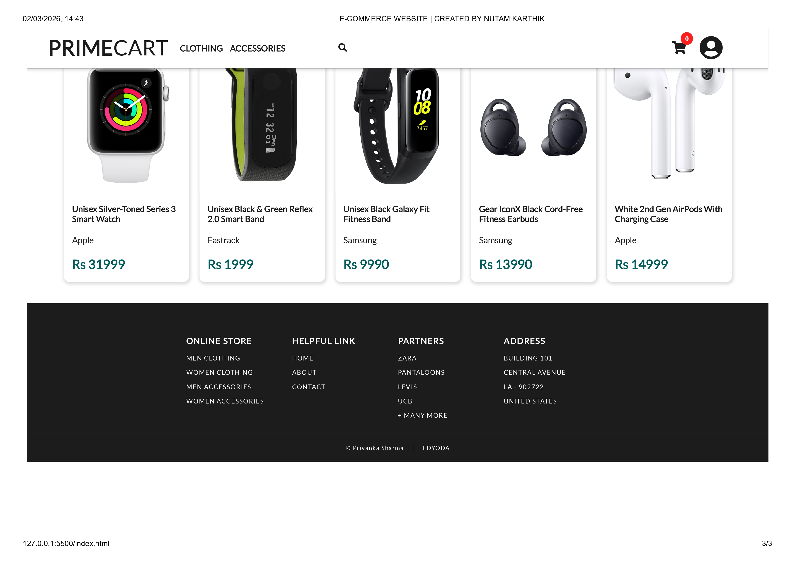
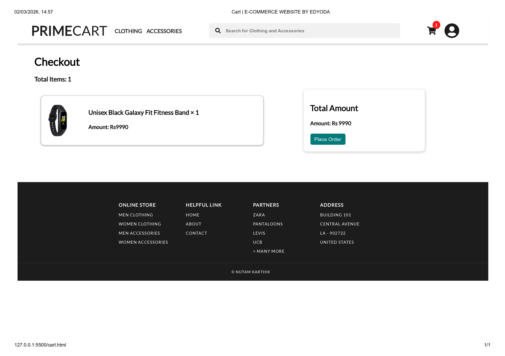
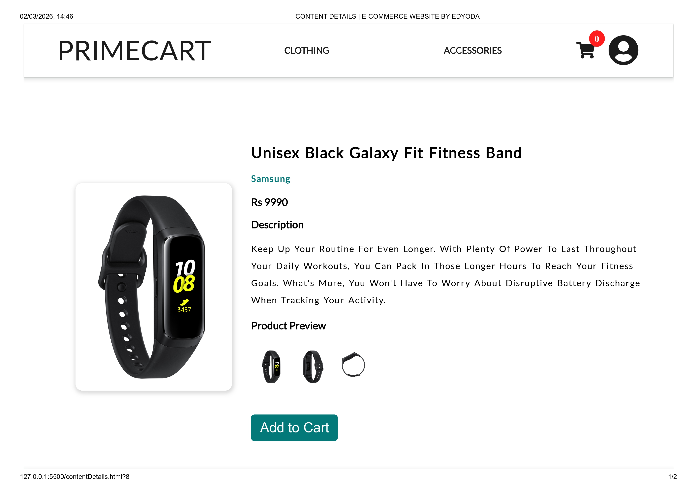
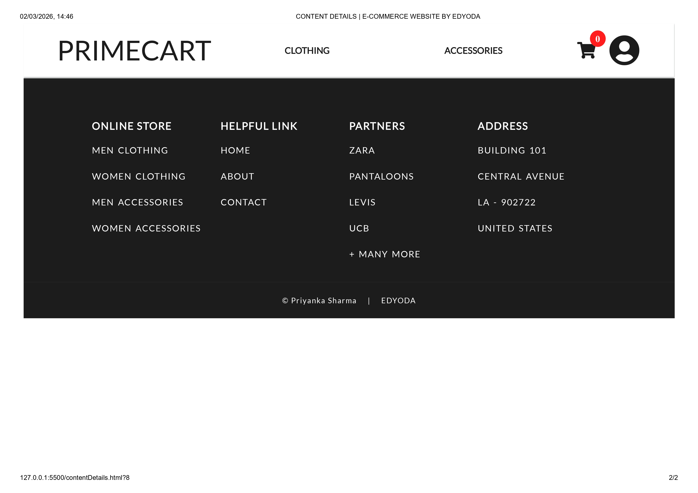
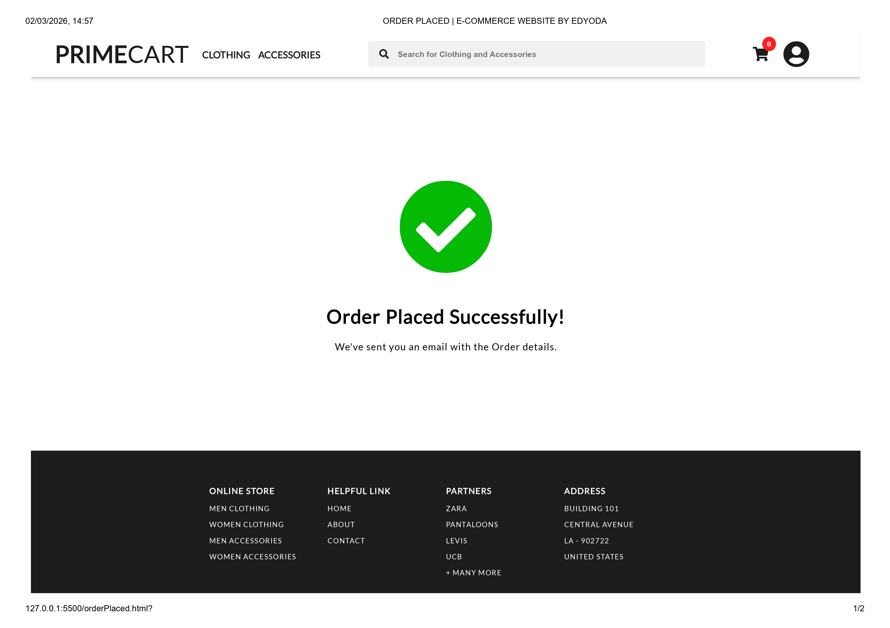

# PrimeCart – E-Commerce Web Application

PrimeCart is a responsive E-Commerce web application developed as part of my internship project.  
The application provides a seamless online shopping experience including product browsing, cart management, and order confirmation.

---

### Live demo 
https://karthiknutam06.github.io/Ecommerce-Website/

## 🚀 Features

- Responsive Home Page
- Product Listing Page
- Product Details View
- Add to Cart Functionality
- Dynamic Cart Management using Local Storage
- Order Confirmation Page
- Clean and User-Friendly UI

---

## 🛠️ Technologies Used

- HTML5
- CSS3
- JavaScript (ES6)
- Local Storage API

---

## 📸 Project Preview

### 🔐 Access Pages

### 🛒 Cart & Order Management

### 💳 Payment Page

---

## 🎯 Project Objective

The objective of this project is to design and develop a fully functional front-end E-Commerce website that demonstrates practical implementation of web development concepts including DOM manipulation, responsive design, and client-side data storage.

---

## 📍 Live Demo

(Enable GitHub Pages and paste your live link here)

---

## 👨‍💻 Developed By

**Karthik Nutam**  
